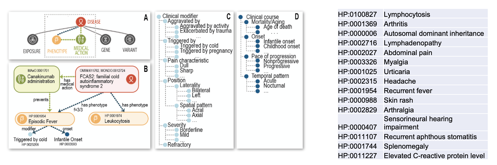

# :material-tag-multiple-outline: HPO Annotations (HPOAs)

HPO terms do **not** themselves describe diseases. Instead, the HPO project provides **annotations** that connect diseases to
phenotypic abnormalities, forming **computational disease models**.

## :material-dna: Disease models using HPO
For example,  
[Marfan syndrome](https://hpo.jax.org/browse/disease/OMIM:154700){:target="_blank"}
is characterised by **50+ phenotypic abnormalities**, including  
[Aortic root aneurysm](https://hpo.jax.org/browse/term/HP:0002616){:target="_blank"}.

Each abnormality is represented by a structured HPO term, allowing algorithms
to compare patient phenotypes with known disease profiles.

---

!!! abstract "How HPO annotations work"

    { align=center width="100%" }

    Example disease annotations for [Familial cold autoinflammatory syndrome 2](https://hpo.jax.org/browse/disease/OMIM:611762){:target="_blank"}.

---

## :material-tune-variant: Annotation modifiers

Annotations can include **modifiers** that add clinical context, such as:

- Age of onset
- Frequency of a feature
- Clinical qualifiers

For instance, **Brachydactyly (HP:0001156)** is rare in *Hydrolethalus syndrome*
(3/56 cases in a published cohort), but occurs in nearly **100%** of patients
across many of the other ~484 diseases annotated with this term.

These quantitative annotations allow computational tools to **weight findings**
when performing phenotype-driven differential diagnosis.

**Next Module:** [MAxO](maxo.md){ .md-button .md-button--primary }