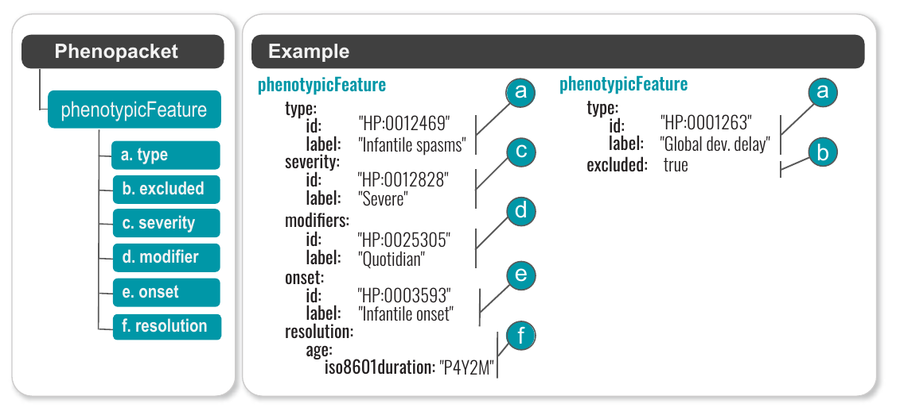
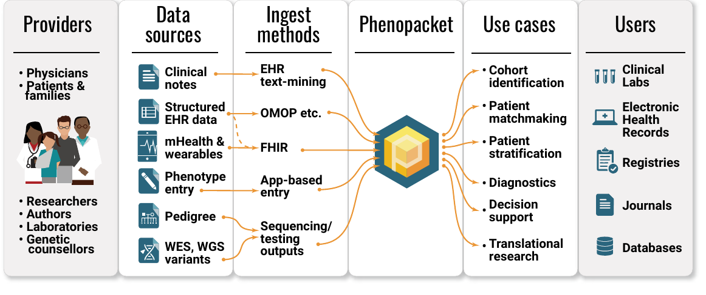

# GA4GH Phenopacket Schema

The Global Alliance for Genomics and Health ([GA4GH](https://www.ga4gh.org/){:target="_blank"}) is an organization developing a suite of coordinated standards for genomics. 

## The GA4GH Phenopacket is designed to be a computable representation of a case report
{width="800"}

The GA4GH Phenopacket Schema is a standard for sharing disease and phenotype information characterizing an individual person or biosample. The Phenopacket Schema is flexible and can represent clinical data for any kind of human disease including RD, complex disease, and cancer. It also allows consortia or databases to apply additional constraints to ensure uniform data collection for specific goals. The Phenopacket Schema  was accepted by the International Standards Organization (ISO) as [ISO 4454:2022](https://www.iso.org/standard/79991.html){:target="_blank"}.

## Structure of the Phenopacket Schema

!!! abstract "Figure 1: Phenopacket Schema Overview"
    { align=center }
    
    **Phenopacket Schema overview.** The GA4GH Phenopacket Schema is a hierarchical structure that consists of two required fields, `id` and `MetaData`, as well as eight optional fields:
    
    * **Individual** & **Disease**
    * **Interpretation** & **Biosample**
    * **PhenotypicFeature** & **Measurement**
    * **MedicalAction** & **Files**
    
    Each of these modules is discussed in detail within this article. A detailed version of the schema, including elements from VRS/VRSATILE, is shown in the reference documentation.
    {: .small-text }

## Example: PhenotypicFeature
The PhenotypicFeature is the central element of the Phenopacket Schema. In essence, it contextualizes an HPO term by providing additional information.

A PhenotypicFeature can be used to describe each phenotypic feature (often, but not necessarily, clinical abnormalities) including signs and symptoms, laboratory findings, imaging, and electrophysiological results, along with modifier and qualifier concepts. Each phenotypic feature is described using an ontology term. One can indicate whether a certain abnormality was excluded during the diagnostic process (e.g., whether a morphological cardiac defect was excluded by echocardiography), or optionally use other HPO terms to denote the severity of the phenotypic feature or add other modifiers that describe the frequency (e.g., number of occurrences of seizures per week), laterality (e.g., unilateral), or another pattern of a certain phenotypic feature in the patient being described. Finally, the onset (and if applicable the resolution) of specific features can be indicated .

!!! abstract "Figure 1: PhenotypeFeature"
    { align=center }
    
    **PhenotypeFeature overview.** The PhenotypeFeature of the Phenopacket Schema has fields for specifying:
    
    * **type**: An HPO term
    * **excluded**: If this is set to true, it means that the HPO term was explicitly excluded by clinical examination or some other diagnostic modality.
    * **Severity** Optionally, a term from the HPO [Severity subontology](https://hpo.jax.org/browse/term/HP:0012824){:target="_blank"} can be added
    * **Modifier** & Optionally, one or more terms from the HPO [Clinical modifier `HP:0012823` subontology](https://hpo.jax.org/browse/term/HP:0012823) can be added
    
    Each of these modules is discussed in detail within this article. A detailed version of the schema, including elements from VRS/VRSATILE, is shown in the reference documentation.
    {: .small-text }

## Phenopackets Ecosystem

!!! abstract "Figure 1: Phenopacket Ecosystem"
    { align=center }
    
    **Phenopacket Schema overview.** The GA4GH Phenopacket Schema is a hierarchical structure that consists of two required fields, `id` and `MetaData`, as well as eight optional fields:
    
    * **Individual** & **Disease**
    * **Interpretation** & **Biosample**
    * **PhenotypicFeature** & **Measurement**
    * **MedicalAction** & **Files**
    
    Each of these modules is discussed in detail within this article. A detailed version of the schema, including elements from VRS/VRSATILE, is shown in the reference documentation.
    {: .small-text }

